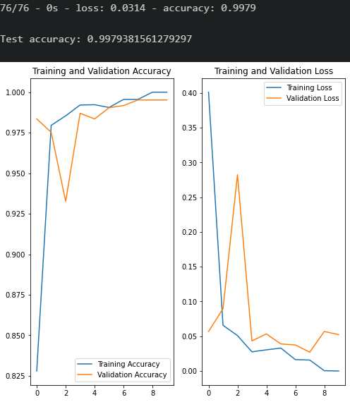
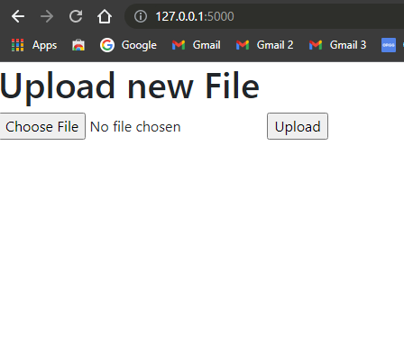
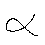
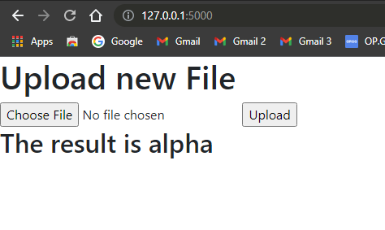

# Data Scientist Capstone
# Handwritten Greek Leters Prediction Model

### Dependencies
* Python 3+
* Machine Learning Libraries: NumPy, SciPy, Pandas, Sciki-Learn, TensorFlow, Keras
* Web App and Data Visualization: Flask, Plotly

## Project Definition
### Project Overview
For this project, we used Deep Learning to be able to predict greek letters, by using a pre-existing dataset from Kaggle (Refernced below).
### Strategy to solve the problem
Due to applications being hard to recognize greeks letters in mathematical equations, this project will be able to recognize greek letters in-between mathematical equations,
thus we use deep learning to be able to predict users handwritten letters.
### Metrics
We use Training and Validation Accuracy and Loss to see our models preformance.

## Analysis
### EDA
Since the dataset used has alot of classes ive only picked 4 which are (Alpha, Beta, Pi, Theta) with a total of 9,700 observations, and since the dataset is composed of images, there is no need to remove any of them, and since the Dataset is balanced there is no need to tamper with the data.

## Modeling
The dataset was split into training and testing set by 0.25 ratio and 0.2 validation ratio on the training set, the model used is a Convolution Neural network model with 3 convolution layers and 5 hidden layers and an output layer.

### Hyperparameter tuning
initially, the hyperparameters were to run 10 epochs with a  batch size 10

## Wep app
After running the app.py and opening the local website

upload the handwritten letter

and result will show after pressing the upload button

## Conclusion
In Conclusion the model can accurately predict 99% of the time but it is critical to have a bit of error to not be biased on prediction.
## Improvement
For future work, I would add more to the dataset to have more classes than 4 and have a better user-friendly UI to make it easier for the user to use.

## Authors

* [Ghanim Alghanim](https://github.com/L9Sneaky)

## License

## Acknowledgements

* [Udacity](https://www.udacity.com/) for providing such a complete Data Science Nanodegree Program

## References
1. Dataset (https://www.kaggle.com/sagyamthapa/handwritten-math-symbols)
